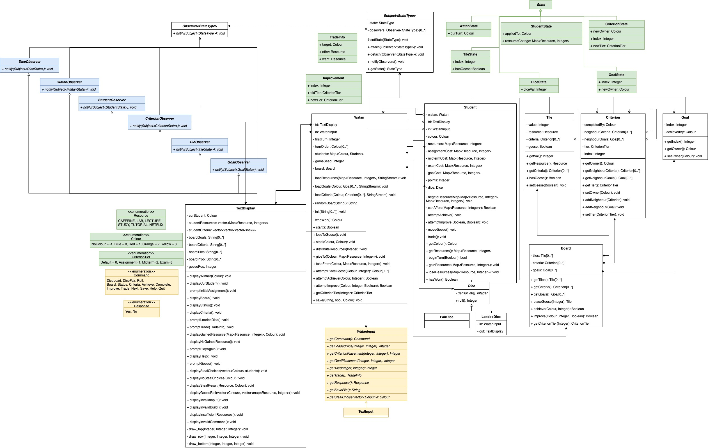

# Watan is a game based off the board game Catan

This was the result of a group project using object oriented C++ to implement a command line game.
The game's architecture was designed with MVC pattern in mind so that a full graphics gameplay could be later implemented.

